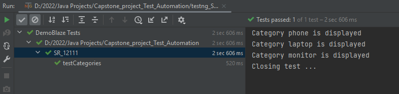
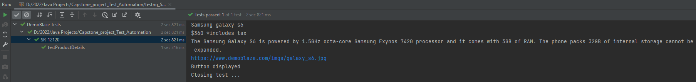
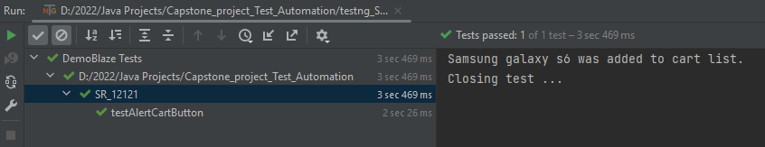
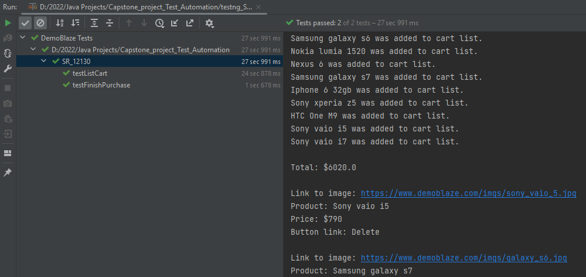
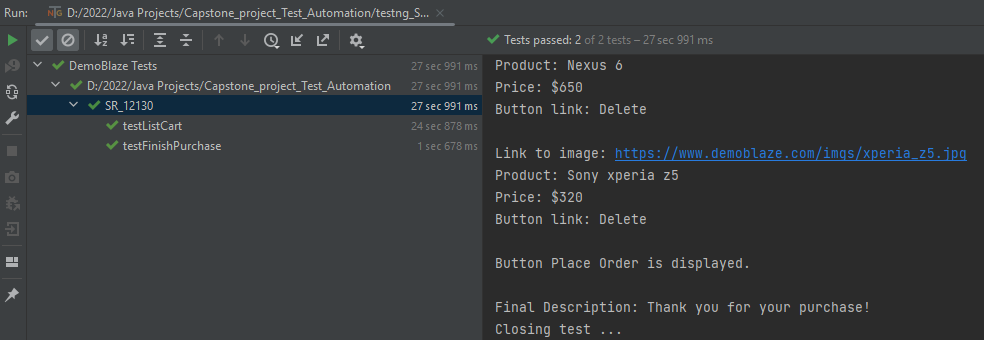
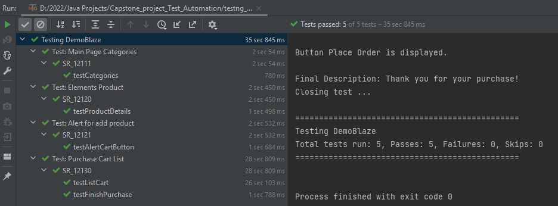
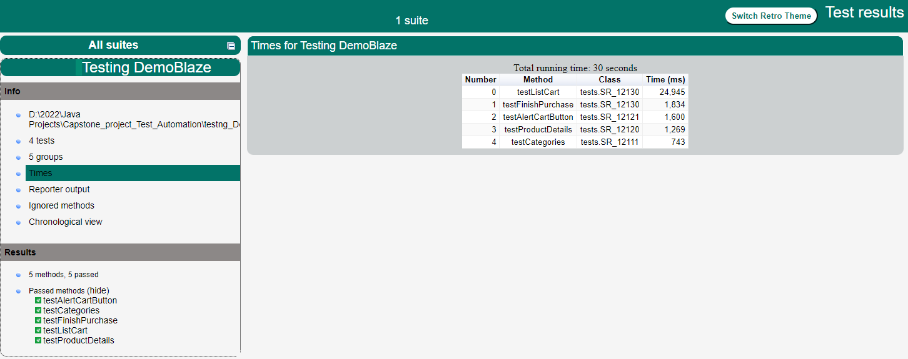
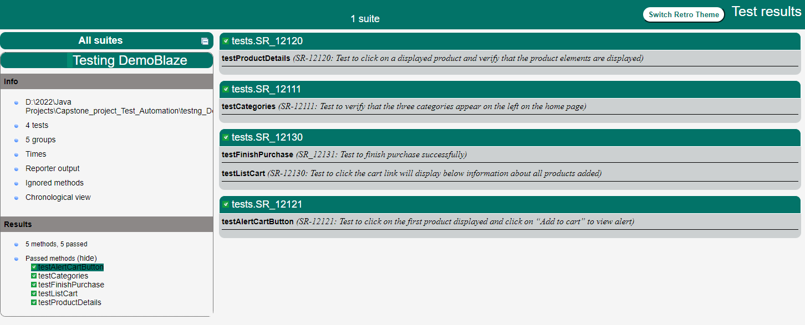

# Test Automation Bootcamp 2.0 by ITJuana

## [Test Cases for Capstone Project](src/main/resources/filesPDF/ITJ_BootCamp_Test_Automation_TestCases_Diego_Flores.pdf)

#### [Complete in order to get certification (Capstone Project)](src/main/resources/filesPDF/Capstone_Project_ITJ_Automation_Bootcamp_2.pdf)

#### [WebApp to Automate Tests](https://www.demoblaze.com/)

---

# Setup
- Java 8
  - jdk 1.8.0_341
- IntelliJ IDE
- Maven dependencies:
  - Selenium-java v4.6.0 
  - Testng v7.5 
  - Datafaker v1.7.0

Note: To run the tests correctly it is necessary to specify which web driver to use. In [BaseTest](src/main/java/tests/BaseTest.java) you can change it depending on the browser you are using. 

---

# XML files to run Tests

### 1. Run test case SR-12111: [testng_SR-12111.xml](testng_SR-12111.xml)

Expected result:

### 2. Run test case SR-12120: [testng_SR-12120.xml](testng_SR-12120.xml)

Expected result:

### 3. Run test case SR-12121: [testng_SR-12121.xml](testng_SR-12121.xml)

Expected result:

Expected result:
### 4. Run test case SR-12130: [testng_SR-12130.xml](testng_SR-12130.xml)

Expected result:

Keep scroll down

### 5. Run all test cases: [testng_DemoBlaze.xml](testng_DemoBlaze.xml)

Expected result:

---

## TestNG Report
#### [HTML File for Report TestNG](out/index.html)
Expected result to report:

